# flutter_ai_demo

A showcase app for the [`flutter_ai`](../README.md) package family — a live chat
screen and a gallery of every element, styled with a custom `AiThemeExtension`
(no stock-Material chrome, no ripples).

## Chat in action

A scripted provider streams reasoning → a tool call → the answer → a citation,
with the composer swapping Send for Stop while streaming:

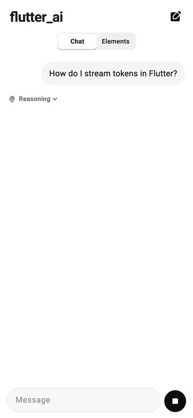

## Dark mode

Every element is theme-driven, so dark mode is just `AiThemeExtension.dark()` on
a dark `ThemeData` (toggle it with the header icon):

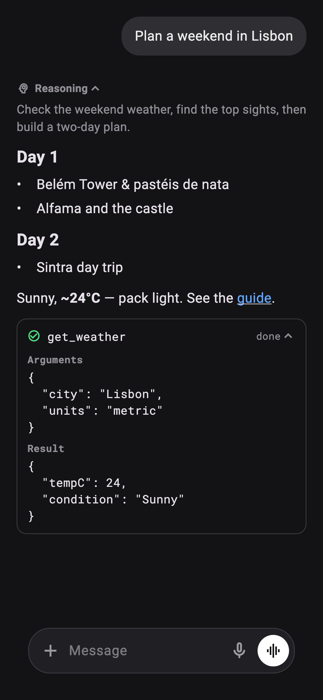

## Run it

```bash
flutter run                                       # scripted provider, no key
flutter run --dart-define=GEMINI_API_KEY=your_key # live Gemini (with grounding)
```

With no key the chat uses an in-app scripted provider — **no API key required**.
Passing `GEMINI_API_KEY` switches to the native Gemini provider (with Google
Search grounding). For OpenAI or Anthropic, swap the provider in `lib/main.dart`
(`_buildProvider`) — e.g. `OpenAiProvider(apiKey: ...)` — and pass your key via
`--dart-define`.

## Regenerate the screenshots

Screenshots and the GIF are produced headlessly via a golden-capture test (real
fonts loaded from the SDK), then assembled with ffmpeg:

```bash
flutter test test/capture_test.dart --update-goldens
ffmpeg -y -framerate 8 -i test/shots/chat_%03d.png \
  -vf "scale=380:-1:flags=lanczos,split[a][b];[a]palettegen=stats_mode=diff[p];[b][p]paletteuse" \
  screenshots/chat.gif
```

A few of these are also mirrored into `packages/flutter_ai_elements/screenshots/`
for the pub.dev listing (referenced by that package's `screenshots:` field); copy
the updated files over after regenerating.

## Elements

| | | |
|:--:|:--:|:--:|
| <br/>**AiMessageBubble** (user) | 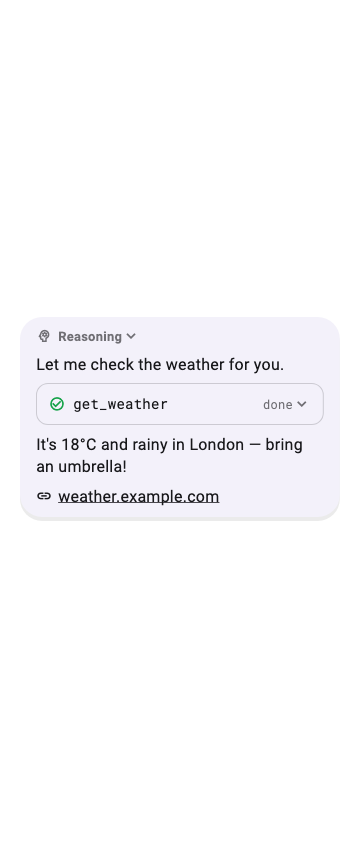<br/>**AiMessageBubble** (rich) | 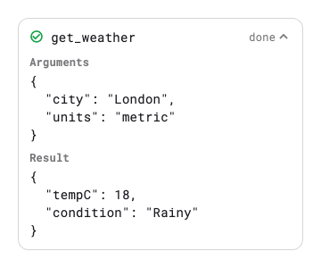<br/>**AiToolInvocation** |
| 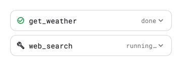<br/>**AiToolGroup** | 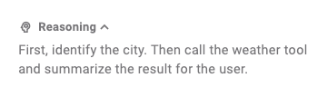<br/>**AiReasoning** | 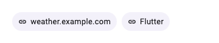<br/>**AiSources** |
| 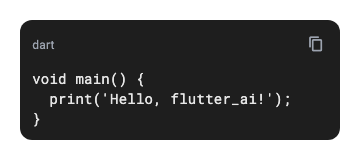<br/>**AiCodeBlock** | 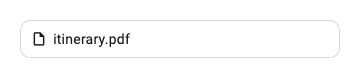<br/>**AiAttachment** | 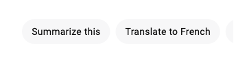<br/>**AiSuggestions** |
| 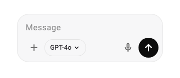<br/>**AiComposer** (idle) | 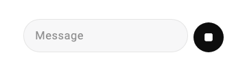<br/>**AiComposer** (streaming) | 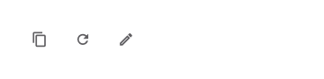<br/>**AiMessageActions** |
| 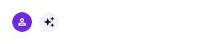<br/>**AiAvatar** | 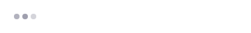<br/>**AiLoader** | 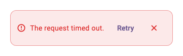<br/>**AiErrorBanner** |
| 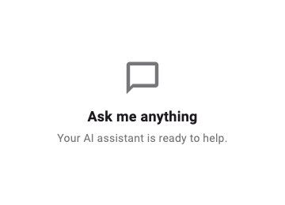<br/>**AiEmptyState** | 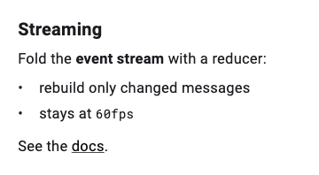<br/>**AiResponse** (Markdown) | 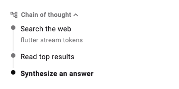<br/>**AiChainOfThought** |
| 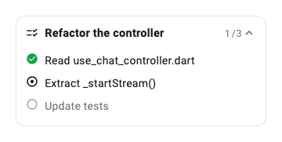<br/>**AiTask** | 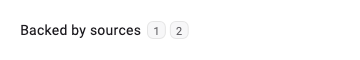<br/>**AiInlineCitation** | 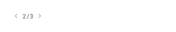<br/>**AiBranch** |
| 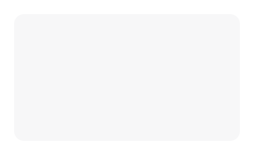<br/>**AiImage** | 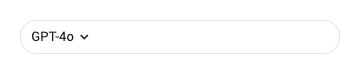<br/>**AiModelSelector** | 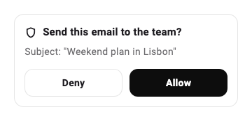<br/>**AiConfirmation** |
| 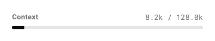<br/>**AiContextMeter** | 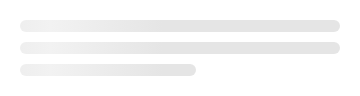<br/>**AiShimmer** | 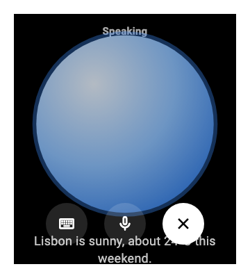<br/>**AiLiveSession** (voice) |
