# flutter_ai_demo

A showcase app for the [`flutter_ai`](../README.md) package family — a live chat
screen and a gallery of every element, styled with a custom `AiThemeExtension`
(no stock-Material chrome, no ripples).

## Chat in action

A scripted provider streams reasoning → a tool call → the answer → a citation,
with the composer swapping Send for Stop while streaming:

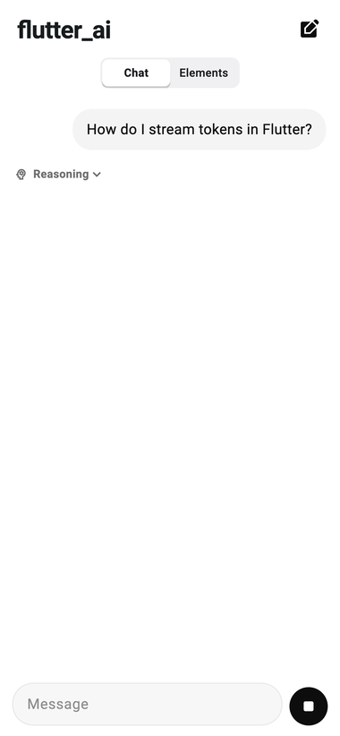

## Dark mode

Every element is theme-driven, so dark mode is just `AiThemeExtension.dark()` on
a dark `ThemeData` (toggle it with the header icon):

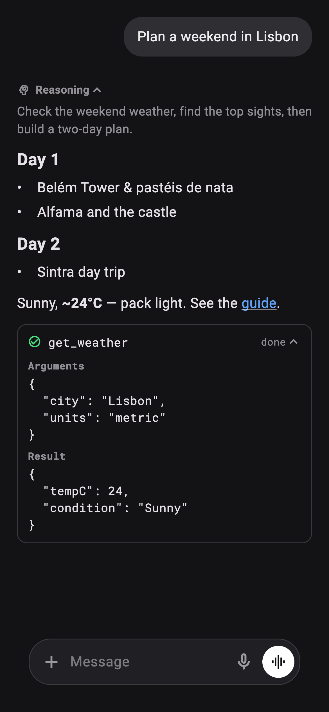

## Production recipe

A minimal, production-style conversation built only from existing elements:
starter grid, a compact run summary from real tool state, the answer, a
source-details sheet, full-width follow-ups, a question that leads to an
actionable result card, an approval gate and a failed run with Retry. Open it
from **Production recipe** on the home screen, or run it alone:

```bash
flutter run -t lib/main_production.dart
flutter run -t lib/main_production.dart --dart-define=RTL=true
```

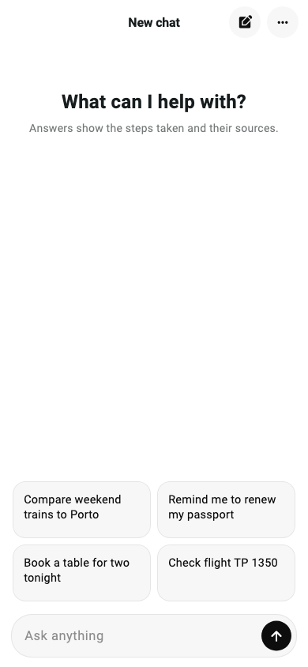
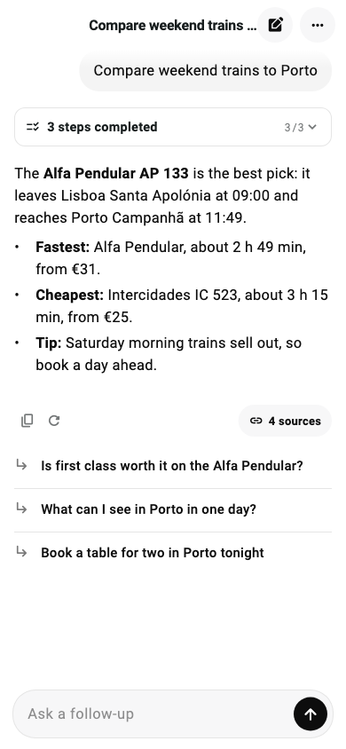
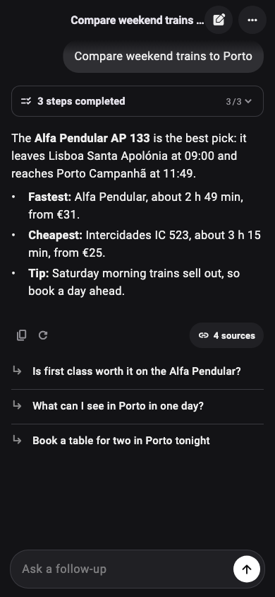
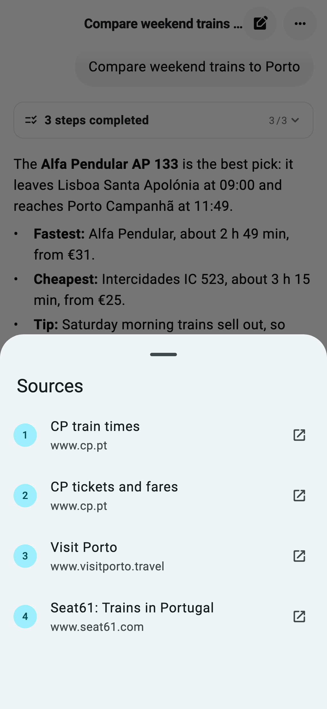

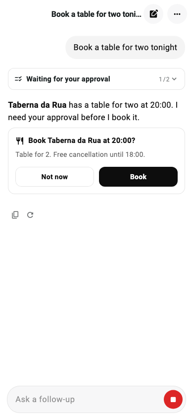
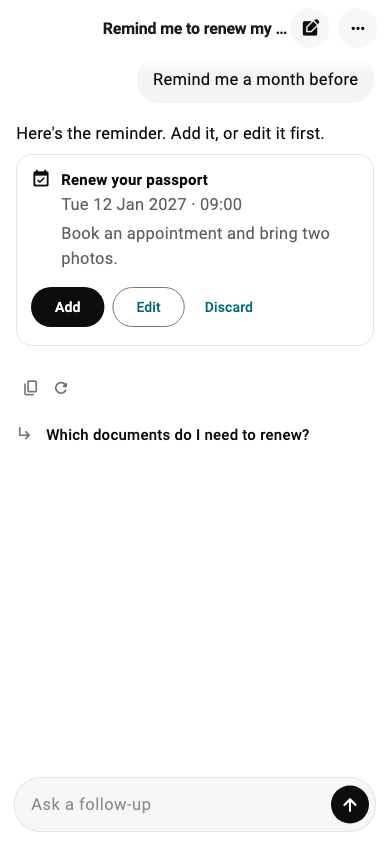
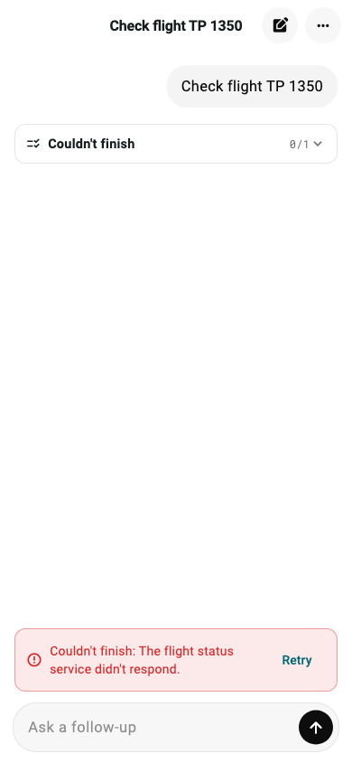
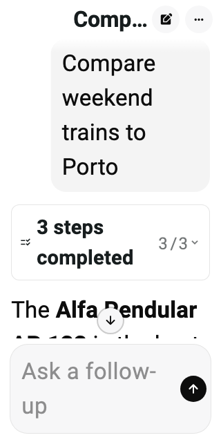

These are rendered by the golden checks in `test/production_golden_test.dart`.
Interaction checks are in `test/production_recipe_test.dart`. Design notes and
Mobbin references are in
[recipe 13](../docs/recipes.md#13-production-mobile-agent-conversation).

```bash
flutter test test/production_recipe_test.dart
flutter test test/production_golden_test.dart   # --update-goldens to refresh
```

## Run it

```bash
flutter run                                       # scripted provider, no key
flutter run --dart-define=GEMINI_API_KEY=your_key # live Gemini (with grounding)
```

With no key the chat uses an in-app scripted provider — **no API key required**.
Passing `GEMINI_API_KEY` switches to the native Gemini provider (with Google
Search grounding). For OpenAI or Anthropic, swap the provider in `lib/main.dart`
(`_buildProvider`) — e.g. `OpenAiProvider(apiKey: ...)` — and pass your key via
`--dart-define`.

## Regenerate the screenshots

Screenshots and the GIF are produced headlessly via a golden-capture test (real
fonts loaded from the SDK), then assembled with ffmpeg:

```bash
flutter test test/capture_test.dart --update-goldens
ffmpeg -y -framerate 8 -i test/shots/chat_%03d.png \
  -vf "scale=380:-1:flags=lanczos,split[a][b];[a]palettegen=stats_mode=diff[p];[b][p]paletteuse" \
  screenshots/chat.gif
```

Copy the `element_*.png` files from `test/shots/` into `screenshots/`.

The README media in `docs/media/` and the pub.dev carousel in
`packages/flutter_ai_elements/screenshots/` come from the production recipe:

```bash
flutter test test/production_marketing_shots.dart --update-goldens
cd test/shots
cp prod_answer_light.png   ../../../docs/media/hero-streaming.png
cp prod_answer_dark.png    ../../../docs/media/hero-dark.png
cp prod_empty_light.png    ../../../docs/media/hero-empty.png
cp prod_streaming.png      ../../../docs/media/section-streaming.png
cp prod_result_card.png    ../../../docs/media/section-generative-ui.png
cp prod_approval.png       ../../../docs/media/section-tools.png
cp prod_sources_sheet.png  ../../../docs/media/section-citations.png
cp prod_voice.png          ../../../docs/media/section-voice.png
ffmpeg -y -i prod_answer_light.png -i prod_answer_dark.png \
  -filter_complex "[0]pad=iw+36:ih:0:0:white[a];[a][1]hstack=2,scale=1600:-1:flags=lanczos" \
  ../../../docs/media/section-theming.png
ffmpeg -y -framerate 10 -i prod_run_%03d.png \
  -vf "tpad=stop_mode=clone:stop_duration=2.5,scale=380:-1:flags=lanczos,split[a][b];[a]palettegen=stats_mode=diff[p];[b][p]paletteuse" \
  ../../../docs/media/hero-streaming.gif
# pub.dev carousel (804 px wide)
P=../../../packages/flutter_ai_elements/screenshots
for p in answer:answer_light question:question approval:approval \
         sources:sources_sheet dark:answer_dark; do
  sips --resampleWidth 804 "prod_${p#*:}.png" --out "$P/${p%%:*}.png"
done
```

## Elements

| | | |
|:--:|:--:|:--:|
| <br/>**AiMessageBubble** (user) | 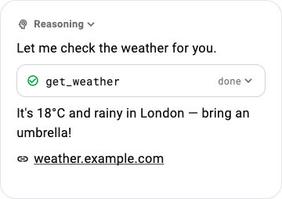<br/>**AiMessageBubble** (rich) | 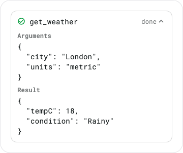<br/>**AiToolInvocation** |
| 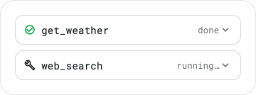<br/>**AiToolGroup** | 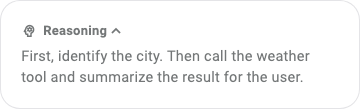<br/>**AiReasoning** | 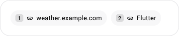<br/>**AiSources** |
| 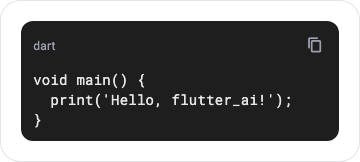<br/>**AiCodeBlock** | 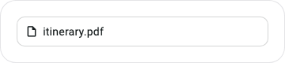<br/>**AiAttachment** | 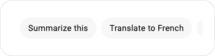<br/>**AiSuggestions** |
| 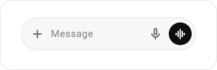<br/>**AiComposer** (idle) | 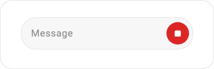<br/>**AiComposer** (streaming) | <br/>**AiMessageActions** |
| <br/>**AiAvatar** | <br/>**AiLoader** | 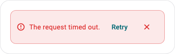<br/>**AiErrorBanner** |
| 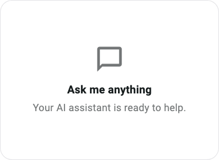<br/>**AiEmptyState** | 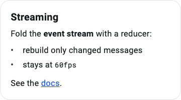<br/>**AiResponse** (Markdown) | 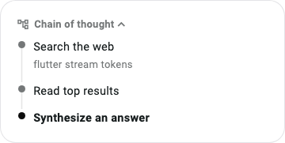<br/>**AiChainOfThought** |
| 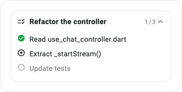<br/>**AiTask** | <br/>**AiInlineCitation** | <br/>**AiBranch** |
| 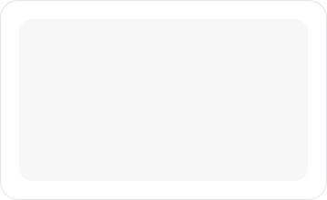<br/>**AiImage** | 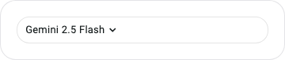<br/>**AiModelSelector** | 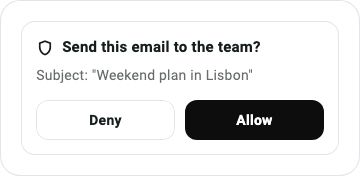<br/>**AiConfirmation** |
| 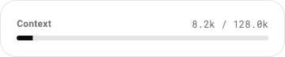<br/>**AiContextMeter** | <br/>**AiShimmer** | 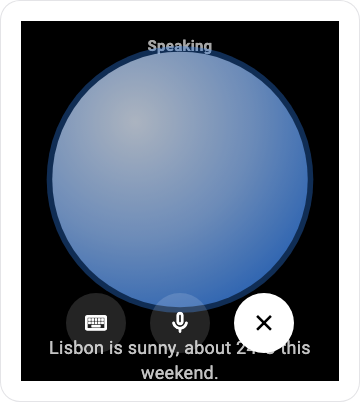<br/>**AiLiveSession** (voice) |
| 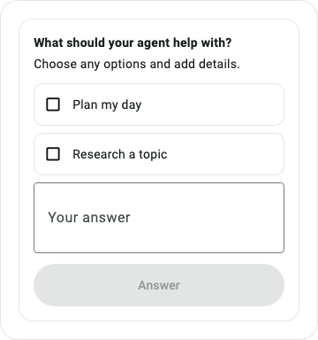<br/>**AiQuestion** | | |
